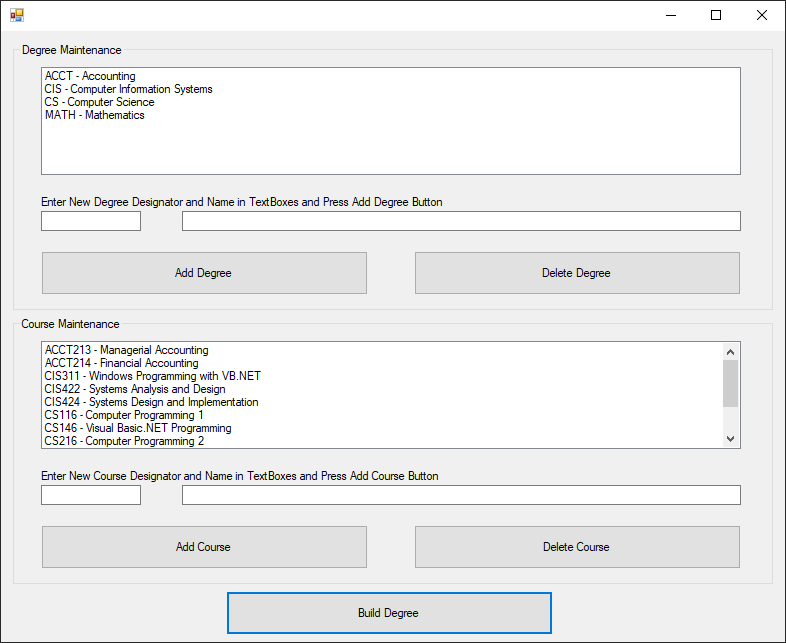
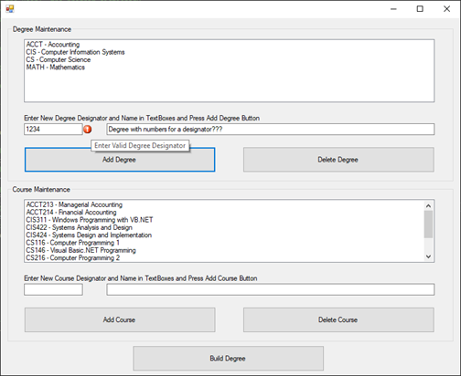
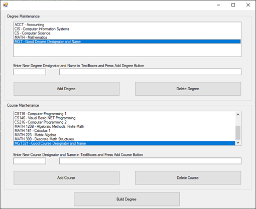
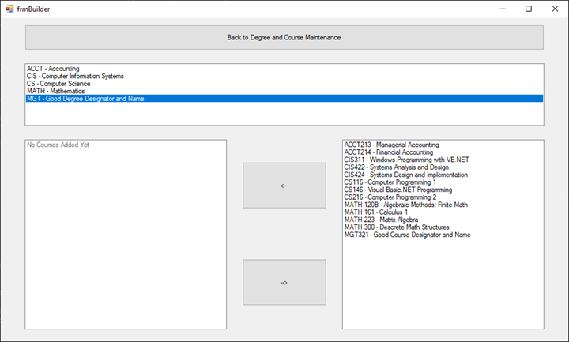
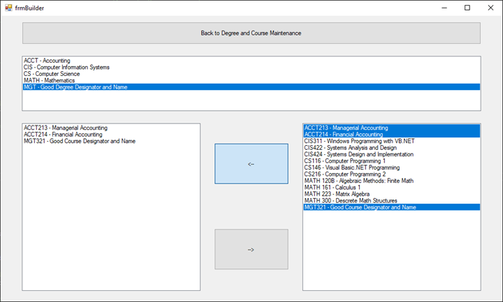
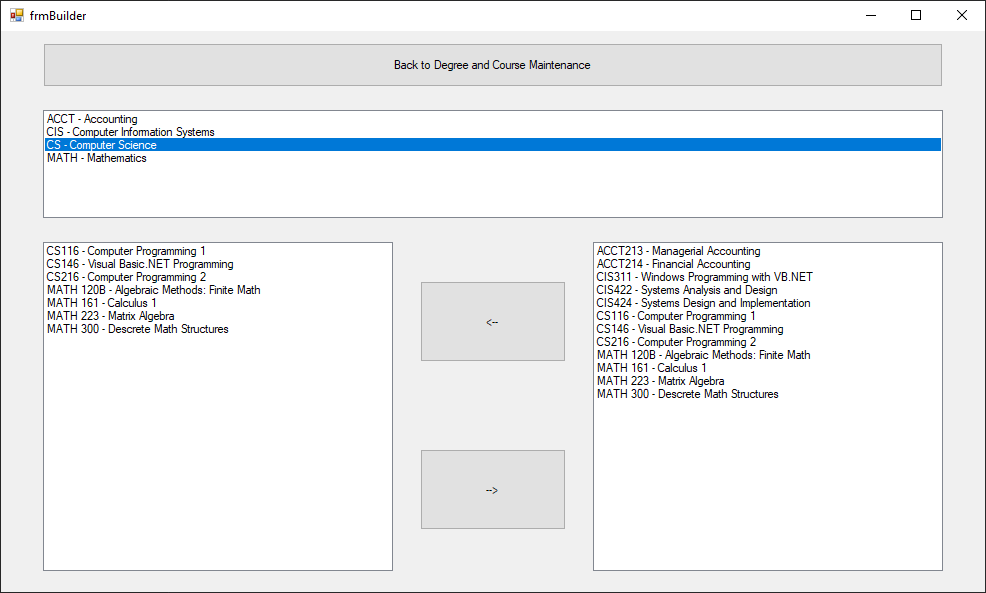

# University-Degree-Builder
Uses data containers to create a system that a University might use to track its degree programs and courses.

Startup:

Data validation - bad data example:

Data validation - good data example:

Empty degree program:

Adding multiple courses to degree program:

Degree with courses added:

